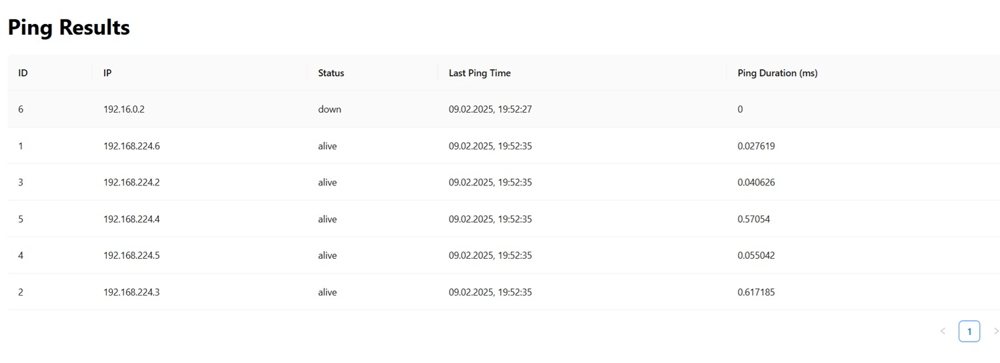

# Container Monitoring App

**Container Monitoring App** — это приложение для мониторинга контейнеров Docker, которое взаимодействует с RabbitMQ и PostgreSQL для хранения информации о контейнерах. Оно предоставляет API для получения информации о контейнерах и мониторинга их состояния в реальном времени.

## 🚀 Технологии и стек

- **Go** — основной язык программирования для бекенда.
- **Docker** — контейнеризация приложения.
- **RabbitMQ** — очередь сообщений для обработки данных (информации о контейнерах).
- **PostgreSQL** — реляционная база данных для хранения информации о контейнерах.
- **Gorilla Mux** — маршрутизатор для обработки HTTP-запросов.

## 📂 Архитектура приложения
Проект имеет следующую структуру:

### backend/
- Взаимодействие с БД (сервис database)
- HTTP-router для отправки данных о контейнерах фронтенду (сервис frontend)
- Реализация consumer'а очереди сообщений RabbitMQ.
- Язык Go, Gorilla-mux для роутинга, библиотека amqp для RabbitMQ.

### frontend/
- Отправка GET-запросов на сервис backend с определенным интервалом для получения данных о контейнерах.
- Визуализации данных о контейнерах.
- Используется библиотека React, язык TypeScript, компоненты AntDesign.

### database/
- Реляционная база данных (Postgres) для хранения информации о контейнерах.
- Содержит скрипт init.sql и Dockerfile для инициализации БД.

### pinger/
- Пинг доступных Docker-контейнеров.
- Отправка информации о контейнерах в RabbitMQ (реализация producer).
- Язык Go, библиотека ping, amqp для rabbitMQ.

### docker-compose.yml
- Конфигурация для запуска всех сервисов.

## 🛠️ Установка и настройка

### 1. Клонирование репозитория

```bash
git clone https://github.com/Optoed/container-monitoring-app.git
cd container-monitoring-app
```

### 2. Поднятие контейнеров
```bash
docker-compose up --build
```

### 3. Переменные окружения
Для работы приложения необходимо настроить переменные окружения.

- `DB_HOST` — хост PostgreSQL (обычно `db`).
- `DB_PORT` — порт PostgreSQL (по умолчанию `5432`).
- `DB_USER` — пользователь для подключения к базе данных.
- `DB_PASSWORD` — пароль для подключения к базе данных.
- `DB_NAME` — имя базы данных.
- `RABBITMQ_URL` — URL для подключения к RabbitMQ (например, `amqp://rabbitmq:5672`).
- `FRONTEND_URL` — URL для фронтенда.

В находящемся в репозитории файле docker-compose.yml они уже прописаны, но при необходимости их можно изменить.

### 4. Запуск приложения
Чтобы запустить приложение, выполните команду:
```bash
docker compose up --build
```
Эта команда запустит все контейнеры. Взаимодействие сервисов можно будет наблюдать в терминале.

Перед запуском рекомендуется прописать следующую команду для остановки контейнеров:
```bash
docker compose down
```

При возникновении проблем с кэшом используйте флаги **--no-cache** и **--volumes**, для очистки кеша и томов.

## 🧑‍💻 Использование

Приложение предоставляет API для получения информации о контейнерах.
Далее будут перечислены несколько способов получения этой информации.

### Вывод информации о контейнерах:
#### Способ №1: в Docker запрос от сервиса frontend к сервису
Отправим в терминале запрос от сервиса frontend в бекенд:
```bash
docker exec -it <frontend-container-name> curl http://backend:8080/containers
```
Чтобы узнать frontend-container-name, можно прописать команду в терминале:
```bash
docker ps
```

#### Способ №2: Локально через веб-страницу в браузере

1) Переход в корневую папку с фронтендом:
```bash
cd ./frontend/docker-monitoring-frontend
```

2) Запускаем локально через yarn фронтенд в браузере:
```bash
yarn start run
```
3) Открываем страницу в браузере по адресу http://localhost:3000 и наблюдаем информацию о контейнерах.

### Пример ответа (JSON):
```json
[
    {
        "id": 2,
        "ip": "192.168.224.3",
        "status": "alive",
        "last_ping_time": "2025-02-09T13:44:26.025867Z",
        "ping_duration": 82204
    },
    {
        "id": 5,
        "ip": "192.168.224.4",
        "status": "alive",
        "last_ping_time": "2025-02-09T13:44:26.025999Z",
        "ping_duration": 151740
    },
    {
        "id": 6,
        "ip": "192.16.0.2",
        "status": "down",
        "last_ping_time": "2025-02-09T13:44:28.034927Z",
        "ping_duration": 0
    }
]
```

## 🌐 Веб-интерфейс приложения
Вот так выглядит интерфейс приложения:

